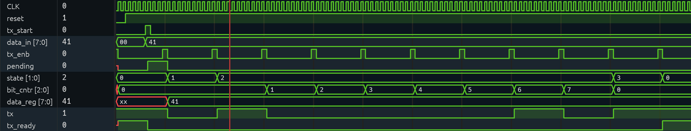

# UART TX (iCEBreaker)

A UART transmitter and baud rate generator, verified in simulation. Takes an
8-bit parallel byte and shifts it out as a standard serial frame: one start bit
(low), 8 data bits LSB-first, one stop bit (high). 9600 baud from the 12 MHz
clock. This is the FPGA-to-laptop "print" path — later it becomes the
memory-mapped output for the RISC-V CPU.

## Structure

Two modules:

**baud_rate_generator** — two free-running dividers making enable pulses. The
TX tick fires once per bit period (12 MHz / 9600 = 1250 cycles). The RX tick
fires 16x faster (divider 78, really 78.125 — rounded, ~0.16% fast, well inside
UART's few-percent tolerance) for oversampling when the receiver gets built.
Neither is a derived clock; both are one-cycle enables, same pattern as every
timed module in this repo.

**tx** — a four-state FSM (IDLE, START, DATA, STOP) plus support logic:

- `pending` — a request latch. `tx_start` is a one-cycle pulse but the FSM can
  only begin on a baud tick, which might be 1200+ cycles away. `pending`
  catches the pulse and holds it until the next tick services it. Pulse sets
  the flag, the slower process clears it when it acts — request/acknowledge.
- `data_reg` — a snapshot of `data_in`, latched on the same tick that starts
  the transmission. After that the outside world can change `data_in` freely;
  the byte in flight is a private copy.
- `bit_cntr` — 3-bit counter indexing which data bit is on the wire. One DATA
  state with a counter instead of eight separate states. `data_reg[bit_cntr]`
  gives LSB-first for free.
- `tx_ready` — high only when idle AND nothing pending, so it never claims
  "ready" while a byte is queued but not yet started.

## The bug worth remembering

The first version entered START directly when `tx_start` arrived. But the baud
tick free-runs — it fires on its own schedule regardless of when a byte is
requested. If `tx_start` landed just before a tick, the START state lasted only
until that tick: a start bit a few clock cycles wide instead of a full bit
period. A receiver would never see it, and it would fail only *sometimes*,
depending on phase — the worst kind of bug.

Fix: don't act on the request, remember it. `pending` latches the request and
the FSM leaves IDLE only when a tick fires with a request waiting. Every state
boundary then lands on a tick, so every bit — including the first — is exactly
one bit period wide. The waveform below shows it: `tx_start` pulses mid-period,
`pending` holds through the gap, and the start bit still comes out full width,
tick to tick.

## Verification

`baud_tx_tb.sv` instantiates the real baud generator and the real tx wired
together (not a faked tick — the free-running-phase behavior is exactly what
needed testing) and sends 0x41. Checked in Surfer: full-width start bit, data
bits 1,0,0,0,0,0,1,0 (0x41 LSB-first), stop bit, tx_ready dropping on request
and returning after the stop.

For simulation the divider is shrunk (tick every 10 cycles instead of 1250) —
the logic only cares about ticks, not their spacing, so the frame is identical
and the waveform is readable. Hardware keeps 1250.

## Build

    make prog

Yosys → nextpnr-ice40 → icepack → iceprog. iCE40UP5K, sg48.
Sim: `iverilog -g2012 -o tx_tb.out baud_rate_generator.sv tx.sv baud_tx_tb.sv && vvp tx_tb.out && surfer tx_tb.vcd`